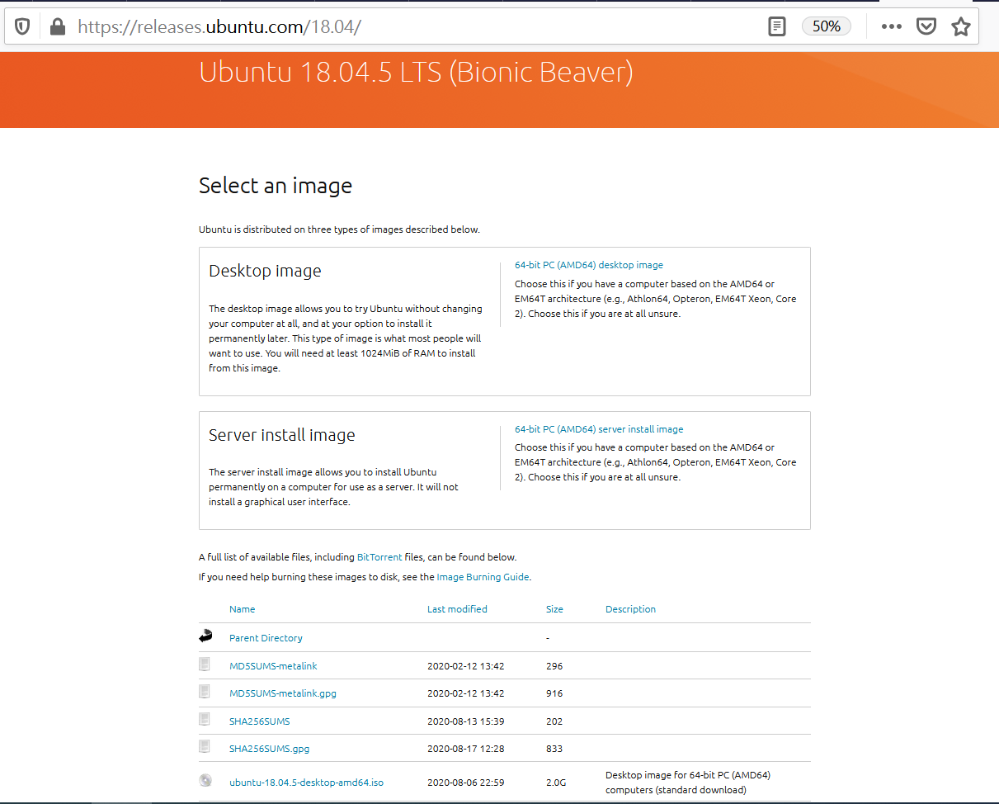
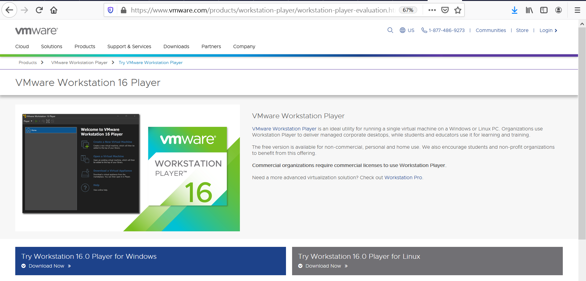
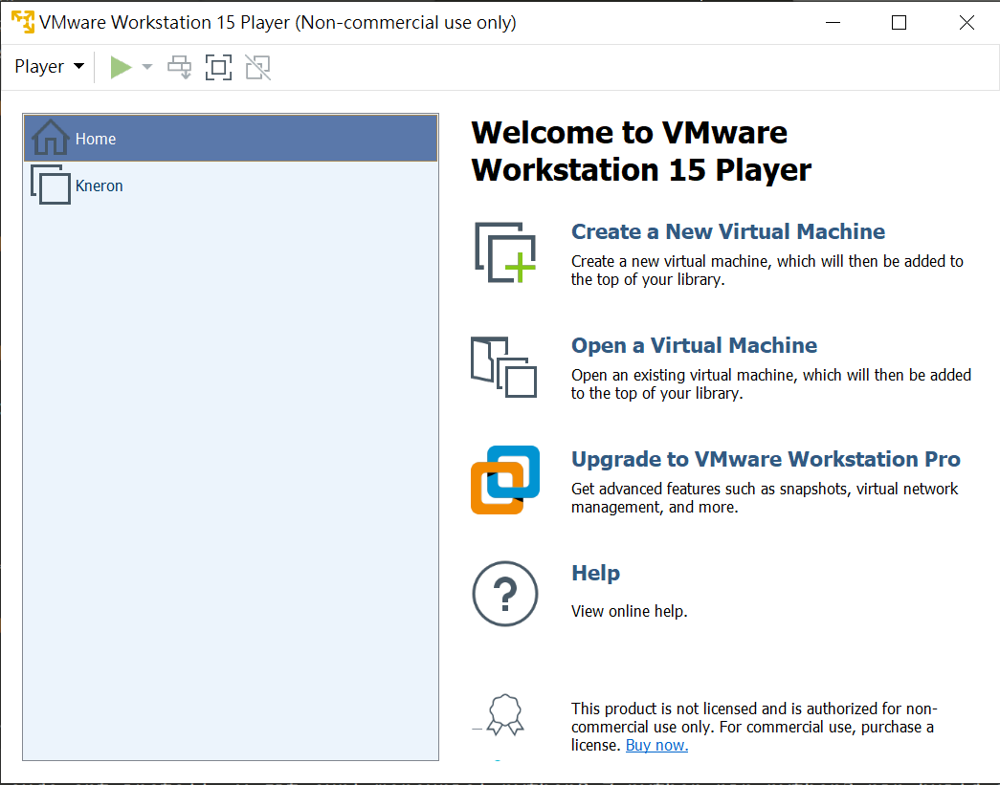
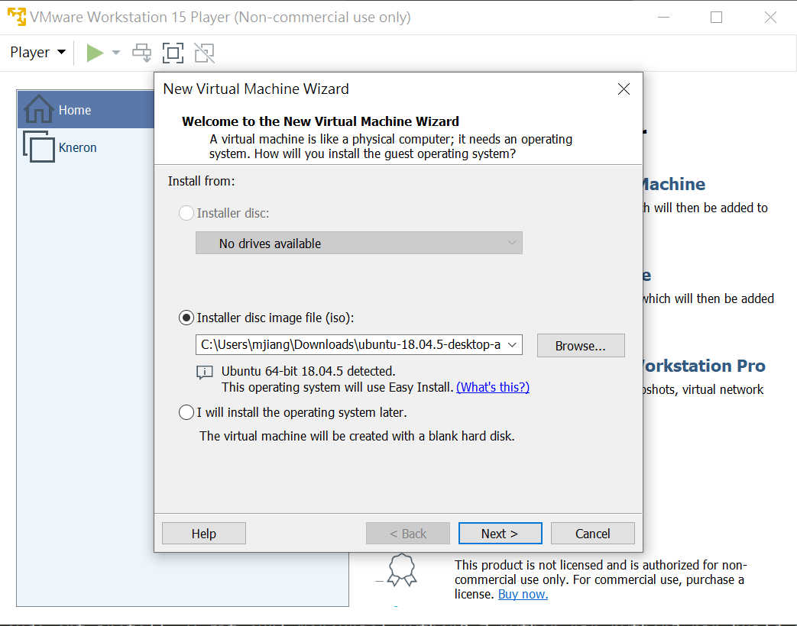
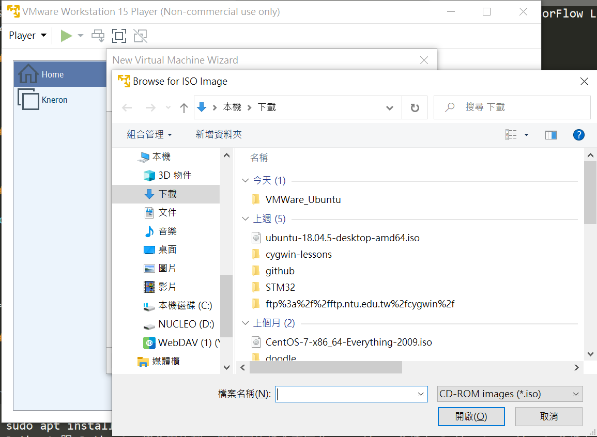
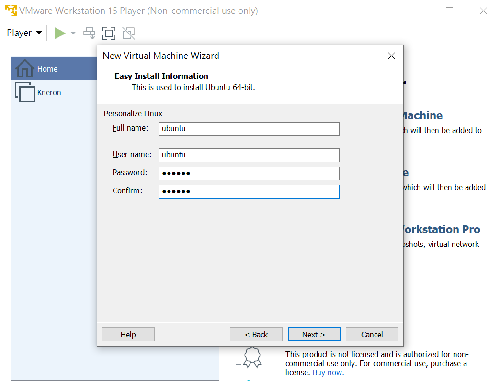
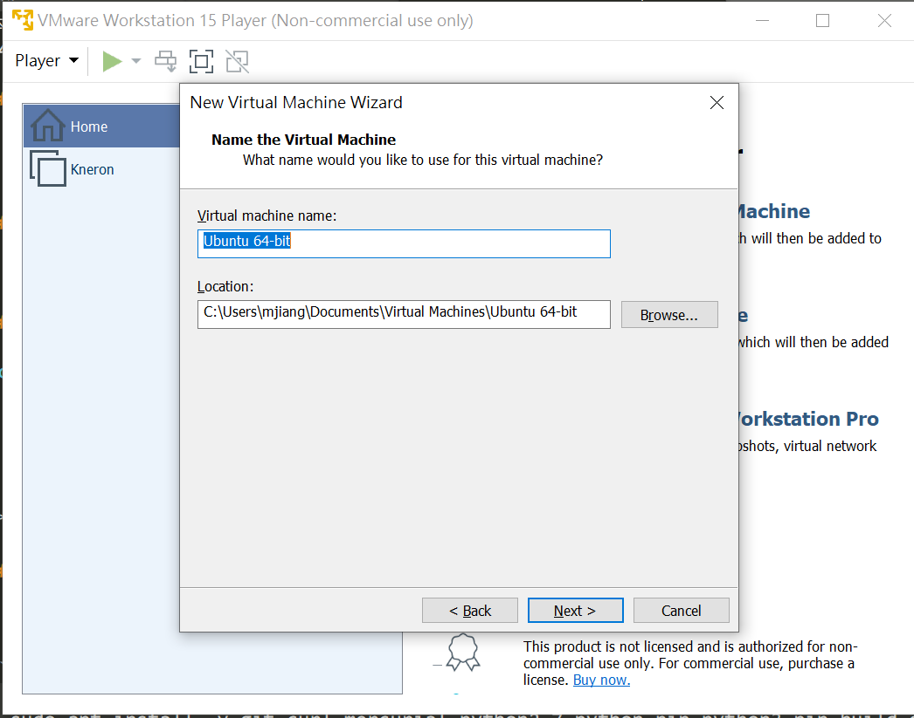
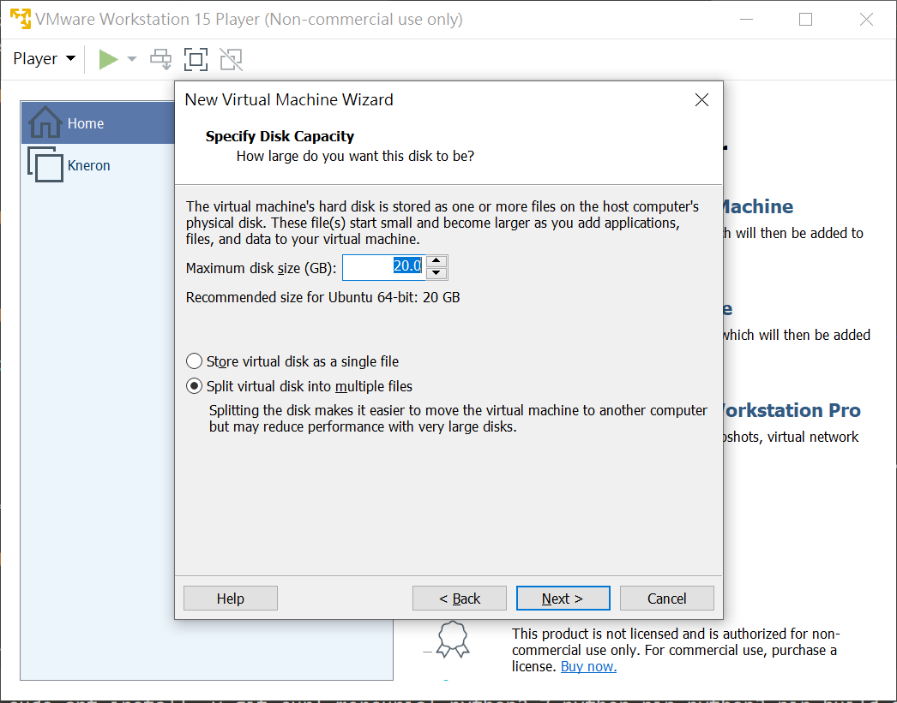
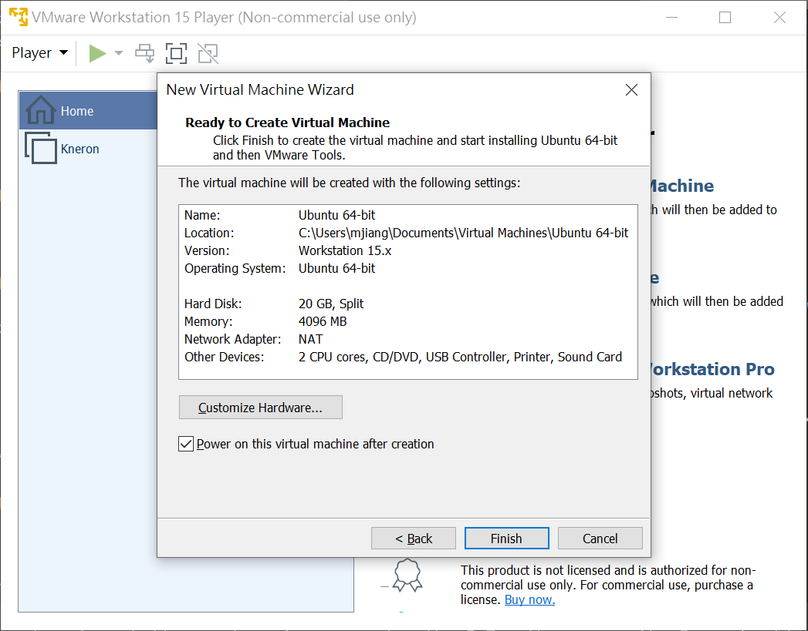
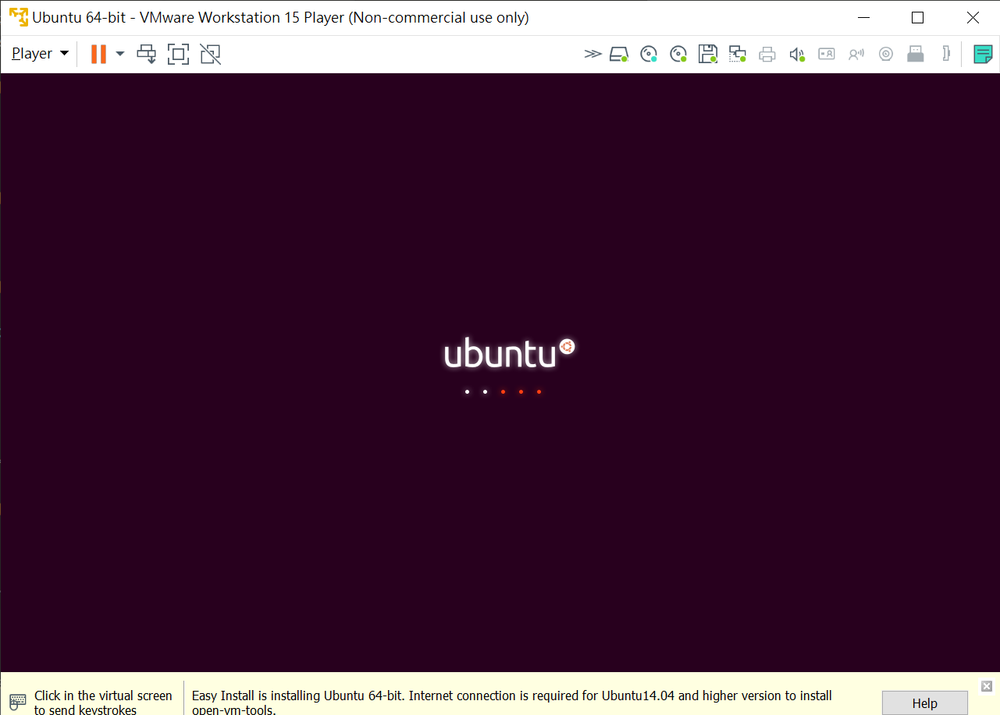

本篇文章說明如何在 Windows 10 上安裝虛擬機器, 執行 Linux - Ubuntu 系統, 以便編譯 TensorFlow Lite Micro 在 STM32 DISCOVERY_F476NG 板子上執行的測試程式

### 0. 事先準備
- 0.1 需要一個 email 位址作為網站下載軟體之註冊用, 
- 0.2 需要在 github.com 上面開個帳號, 對以後的軟體開發會有幫助


### 1. 下載 Ubuntu 18.04 ISO image 檔案
- https://releases.ubuntu.com/18.04/
- 選擇 ubuntu-18.04.5-desktop-amd64.iso 下載, 記住儲存目錄


### 2. 下載及安裝 VMWare Workstation Player
- 2.1 下載 VMWare Workstation Player 安裝程式檔案 https://www.vmware.com/products/workstation-player/workstation-player-evaluation.html

- 2.2 執行 VMWare Workstation Player 安裝程式
  - 安裝完成後, 執行 VMware Workstation Player
- 2.3 Create a new virtual machine. 點選 'Installer disc image file (iso)', 到儲存 ubuntu-18.04.5-desktop-amd64.iso 的目錄後, 開始安裝










*** 以上 2 個動作在上課前完成 ***

### 3. 安裝套件之準備工作
- 進入 Ubuntu OS 後, 打開 terminal 檔案
- 要記得 Ubuntu 的密碼, 執行 sudo 後需要輸入

```
$ sudo apt update
$ sudo apt install -y git curl mercurial python2.7 python-pip python3-pip build-essential screen
# Python2 跟 Python3  都會用的到, 用不同的指令來區分 : python 會指向 Python2; python3 會指向 Python3 (不要問我問甚麼會同時用到 2 個不同版本, 不同的開發團隊, 習慣的作法不同)
```

### 4. 安裝 ARM mbed-os command line 編譯程式 mbed-cli
- 參考文章 [mbed-cli installation](https://os.mbed.com/docs/mbed-os/v5.15/tools/manual-installation.html)

```
$ pip install mbed-cli
```
#### 4.1 設定 mbed 目錄路徑(path)

```
$ sudo find / -name mbed
$ vi ~/.bashrc
# 在 .bashrc 檔案的最後一行 按鍵指令 'a' (append) 加上以下內容, 記得, 不要加上 /mbed
export PATH=$PATH:/path/to/mbed/you/find
# 結束後, 按鍵 ':' + wq! 來儲存
$ source ~/.bashrc
$ mbed --version     # 測試是否正確執行
```

### 5. 安裝 ARM GCC compiler (編譯器)
- 參考文件 [GNU Arm Embedded Toolchain](https://launchpad.net/~team-gcc-arm-embedded/+archive/ubuntu/ppa)

```
# 第一步: 在 Ubuntu OS 內, 打開 terminal 並輸入
$ sudo add-apt-repository ppa:team-gcc-arm-embedded/ppa
# 按 'enter' 繼續

# 第一步: 更新 apt
$ sudo apt update

# 第三步: 安裝 gcc-arm toolchain
$ sudo apt install -y gcc-arm-embedded
# 安裝完成, 測試是否正確執行
$ gcc --version

# 第四步: 安裝 Arm Compiler 5 到 64-bit Linux 系統時, 需要安裝 i386 architecture package
$ sudo dpkg --add-architecture i386
$ sudo apt update
$ sudo apt install -y libc6:i386 libncurses5:i386 libstdc++6:i386
```

### 6. 下載 TensorFlow Lite for Microcontroller (TFLM)

```
# clone from tensorflow github
$ git clone https://github.com/tensorflow/tensorflow.git
``` 

### 7. 下載 STM32-F 系列工具箱
- 7.1 更新 STM32-F 板子的 ST-LINK firmware 到最新版 https://my.st.com/content/my_st_com/en/products/development-tools/software-development-tools/stm32-software-development-tools/stm32-programmers/stsw-link007.html
  - Linux Ubuntu 版本
```
$ cd stsw-link007/AllPlatforms/StlinkRulesFilesForLinux
$ sudo apt update
$ sudo dpkg -i st-stlink-udev-rules-1.0.2-2-linux-all.deb
```
- 7.2 下載 CoolTerm 程式 https://freeware.the-meiers.org/ 
  - 也可以用步驟 3 已經安裝好的 cli 指令 screen, screen 是比較炫技的方法, CoolTerm 對不熟 Linux 環境的人比較 friendly

### 8. 開始執行 TensorFlow Lite for Microcontroller 程式